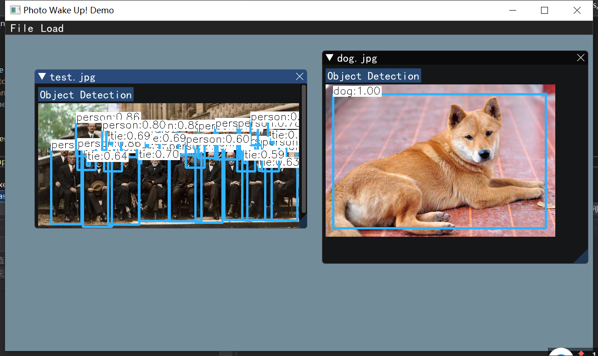

# Photo-Wake-Up

Photo Wake Up Project: [https://grail.cs.washington.edu/projects/wakeup/](https://grail.cs.washington.edu/projects/wakeup/)

Original HMR (End-to-end Recovery of Human Shape and Pose) GitHub: [https://github.com/akanazawa/hmr](https://grail.cs.washington.edu/projects/wakeup/) Angjoo Kanazawa, Michael J. Black, David W. Jacobs, Jitendra Malik CVPR 2018

Paper [link](http://openaccess.thecvf.com/content_CVPR_2019/papers/Weng_Photo_Wake-Up_3D_Character_Animation_From_a_Single_Photo_CVPR_2019_paper.pdf)

## Requirements

* C++ 11
* CMake 3.16.3  
* ImGUI
* OpenCV 4.2.0
* GLFW

## Introduction

### Object Detection

Using OpenCV + Yolo detect people

